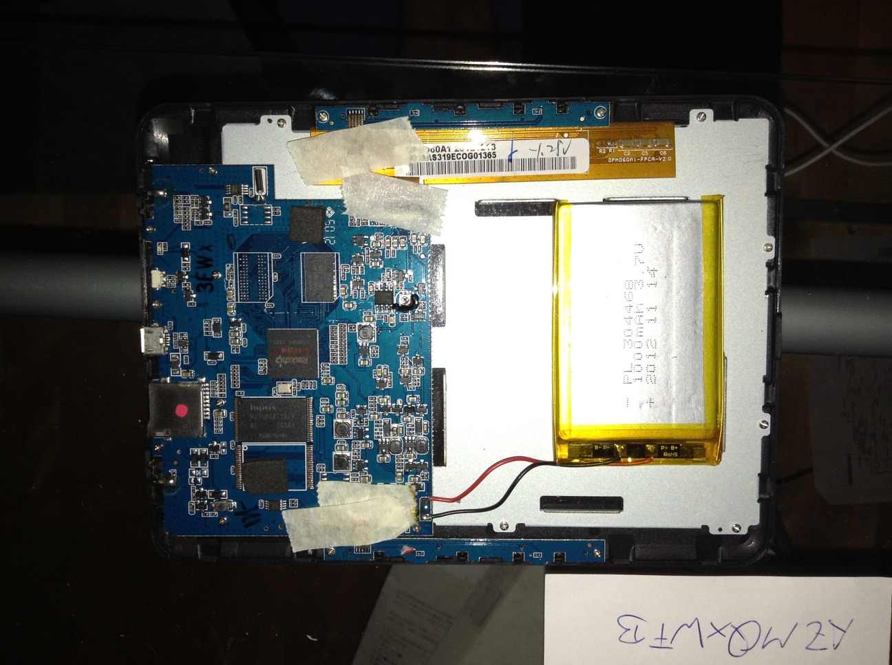
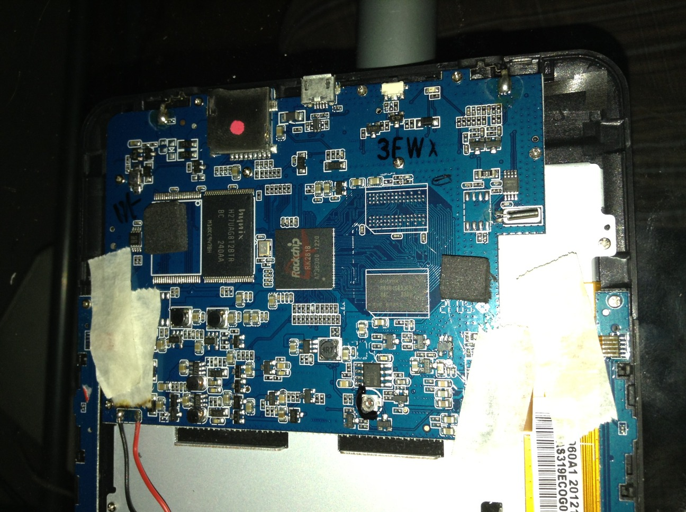

# TrekStor Pyrus / Weltbild 4Ink eBook-Reader

This project documents the TrekStor Pyrus / Weltbild 4Ink eBook-Reader, preserving information about its hardware and firmware.

## What is this device and why this repo?

The TrekStor Pyrus (also known as the Weltbild 4Ink) is an e-ink reader released in 2012 based on the Rockchip 2818 platform. The company TrekStor does not exist anymore as of 2018 (Source: [ComputerBild](https://www.computerbild.de/artikel/cb-News-PC-Hardware-Trekstor-GmbH-Co.-KG-stellt-Insolvenzantrag-4551398.html)) but their devices were sold in multiple countries in Europe (Germany, Italy, UK). 
They were a popular cheap alternative to the Amazon Kindle and don't just hold up nicely today but are also supported by Open Source software like [Calibre](https://github.com/kovidgoyal/calibre).

Below are the technical specifications discovered from analyzing the hardware.

### Specifications

| Component | Details |
|-----------|---------|
| **Processor** | Rockchip RK2818 |
| **RAM** | 1Gb DDR2-RAM by Hynix |
| **Flash Storage** | 2Gb Hynix H27UAG8T2BTR-BC |
| **Display** | OPM060A1-FPCA-V2.0 (Manufacturer details: [OED Tech](http://oedtech.com/English/product/detail.aspx?menuid=030204&pid=52&id=97)) |
| **Battery** | LiPo 1000mAh |

Note: There is also a EBR40-b variant with 4GB of internal storage. I do not know if the firmware below is also applicable for that variant but if anyone is able to dump their EBR40-b and contribute it that would be nice.

## Firmware (tested with EBR40-a)

The device firmware was originally distributed via an `update.exe` tool that downloaded images from the manufacturer's OTA server.

| Version | Notes |
|---------|-------|
| **1.0.54** | The newest known firmware version. |
| **1.0.47** | Older firmware version. |

The latest firmware (1.0.54) used to be available at:
`http://ota.readerportal.de/ebookreader/EBR40-WB-1.0.54.img.zip`

Unfortunately, the update servers are now offline, and the files were not archived, making the original update method impossible but we can use our own firmware dumps to recover / update these devices.

Looking into the .img file there is a FAT file system with various manuals for the TrekStor Liro Ink, eBook Reader 4.0, eBook Reader Pyrus and one called BK6008.

### How to Flash

I have dumped and compressed valid firmware images from two EBR40-a's in the firmware folder so you can extract and flash it to your device using the `rkdeveloptool` available from here: https://github.com/rockchip-linux/rkdeveloptool.

Run the following command:

```bash
rkdeveloptool wl 0 EBR40-WB.1.0.54-FullDump.img
```

Then hold the power button for roughly 10 seconds, release the power button and hold if for roughly 4-5 seconds and it should boot into the new firmware and greet you with the language picker.

### How to preserve the current firmware of your device

> [!CAUTION]
> Doing this will factory reset your device

First press the left or right _next page_ button and then connect your 4Ink via a micro usb cable to your computer to enter Loader Mode.

Then you can use `rkdeveloptool` to read the nand storage of your EBR40-a with the following command:

```bash
rkdeveloptool rl 0 4194304 full_dump.bin
```

For EBR40-b you need to change 4194304 according to the output of `rkdeveloptool rfi` which will read the flash-storage information. 

With EBR40-a you will end up with a roughly 2GB sized `full_dump.bin`. 

Now the Pyrus (4Ink) is stuck in the Loader Mode and you just have to flash the dump back on to it like described above and then you will able to restart it.

## Internal Hardware

Below are images of the device opened up, showing the internal components listed in the specifications courtesy of: https://www.mikrocontroller.net/topic/303268




